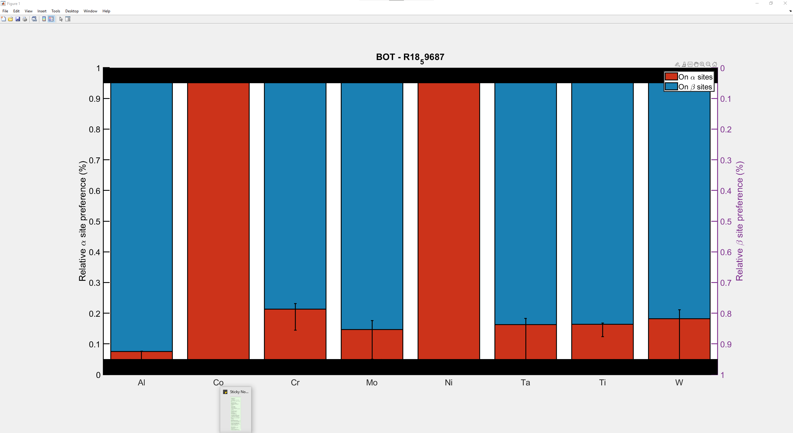

This is to document the use of the SDM peak fitting.
For more details about the scientific background, please read the publication by A. breen & F. Theska et al.
(http://dx.doi.org/10.2139/ssrn.3979337)
For any detail questions feel free to get in touch with us!
A. Breen: andrew.breen@sydney.edu.au
F. Theska: f.theska@unsw.edu.au

Step 1: Open the script file and read-in initial data

    All necessary functions and SDM figure filed should be included in this folder.
    Please note that the original data evaluation was carried out using OriginPro.
    The Gaussian function is set identical, but the area calcuation works somewhat
    differently and is difficult to reproduce accurately with MATLAB. This may impact
    absolute values but should not affect relative observations between locations.

    
    
    Click into the first section Read-in and press Ctrl + Enter to read in initial data.
    If SDMs are generate for additional or fewer elements, adapt the lists "Elements",
    "Bulk", and "Pref" accordingly. Other matrices are empty at this point and will be
    generated based on this information.
    
    

    Double-check the element list so that from top to bottom all elements of interest are
    listed as "Element 1"; "Standard Error Element 1"; "Element 2"; ...
    Keep this matrix open to double-check entries throughout the script.
    
    

    Open the "Planes" matrix to confirm it is not populated yet. 
    Keep this matrix open to double-check entries throughout the script.
    This section does not need to be repeated throughout the different SDMs.
    
    
    
    
Step 2: Open the first SDM and carry out the peak fitting
 

    Ensure that the MATLAB figure file is labelled in a similar fashion as the examples:
    "{Your sample ID} - {X-X}.fig"; where X stands for the elements e.g. Al-Ni.
    Open the first SDM of your choice, the sequence of SDMs should not matter as they
    are sorted to the appropriate element later.
    Click into the second section importing x-y coordinated from SDMs and press Ctrl + Enter
    to start the peak fitting.
    
    

    The first part of this section omits the sample ID to track only the element.
    You may skip this, but the summary table at the end of this cript can get very messy
    this way. x and y correspond to z' [nm] and counts [-], respectively.
    The second part reads the plane spacing for the SDM orientation, which makes the peak 
    fitting more reliable if only two neighbouring planes are observed.
    The third part carries out the SDM_Peakfit function which returns the area under the 
    curve to the appropriate element in the Planes matrix. 
    
    

    The SDM_Peakfit function requires some manual input. Click with the cross hairs on one 
    plane of your choice, e.g. (I) and press Enter, then click on a neighbouring plane of
    your choice, e.g. (II) and press Enter again. In the shown example for Al-Al, the is no
    Al on the A-planes, so make sure that you do not select two B-planes.

    

    After the fitting, data and fitted curve are presented for two seconds. If you prefer to
    keep the plot open, just comment out the "close all", but do not forget to close this plot
    before continuing with the next SDM. The shown example is done for Al-Al, if you are 
    interested in more fitted Al-X SDMs, please have a look into the supplementary figure of
    the published paper. Now double-check the "Planes" matrix and double-check that the 
    standard error is not showing an extremely large number 123E+26 or 123E+27. Sometimes the 
    fit does not work that well and produces a large standard error. Simply close all plots 
    and start again with the same element. 
    
    
    Once you are happy with the peak fit and resulting standard error, close all plots, and
    repeat this section for all elements of interest. You can repeat the same element again
    and the script will overwrite the old values. Once you have completely populated the
    "Planes" matrix, you can move on to the next section
    
    
    
    
Step 3: Sorting measured areas, Calculating alpha and beta site composition,
the ordering parameter and relative elemental site preferences, plot the results
    

    Click in the next section and press Ctrl + Enter. 
    In the first step, major and minor peaks will be sorted according to the qualitative 
    preference in the "Pref list". E.g. If Ni is assigned A, it means an alpha site preference
    for Ni and the major peak will be sorted into the first column as the A planes will contain
    the most Ni. Analog, if Cr is assigned B, beta site preference, the major peak will be
    sorted into the second column as the B planes will contain the most Cr. 
    
    The site compositions and the correlating standard errors are calculated next.
    This will populate the "Sites" matrix.
    
    The ordering parameter and correlating standard error are calculated next.
    This will populate the "OrderPara" matrix. Here, the top entry is the average and the 
    bottom entry is the standard error,
    
    Next, the relative elemental site preference is calculated with corresponding errors.
    This will populate the "SitePref" matrix. 
    
    

    Finally the script will generate a summary table and plot the relative elemental site
    preferences as shown in the example. This shows the absolute site preference without 
    units between 0 and 1. To get these values in (%), simply multiply x 100%. 
    Bottom and top black bars obscure minor changes of the relative preference which are 
    deemed unreliable due to systematic and statistical errors. 
    
    

    The summary table merges inital data, such as qualitative site preference and bulk 
    chemical data with the calculated results. The first column of the plane composition
    refers to the A-planes and the second column to the B-planes. The first column of the
    site occupancies refers to the alpha sites and the second column to the beta sites.
    The first column of the Site preference refers to the preference of the element towards
    the alpha sites and the second column to the preference of the element towards the 
    beta sites. 
    
    
    
    
End of script (:
